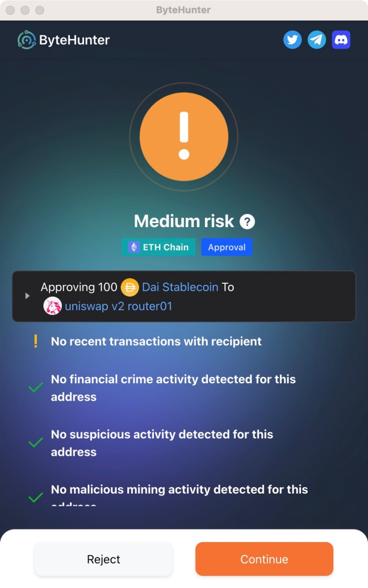

# 🛡ByteHunter
[简体中文](readme/README.zh_CN.md)
***
ByteHunter safeguards all your on-chain interactions, identifies risks and intercepts them
 
You can download it from the [Chrome Store](https://chrome.google.com/webstore/detail/bytehunter/kidhkonioajdkjglffdlojnnlpdbeeol)
 
**Supports the following features🔽**
1. Phishing website detection
2. Malicious extension detection
3. Risk detection for transfer recipients
4. Malicious approval identification
5. NFT $0 Purchase Identification
6. **Over 99% phishing recognition**
7. ......................

## Catalog Structure
- _locales【i18n】
- public【Compiled Output】
- src【Page file】
    - assets【Static Resources】
    - consts【Constants】
    - entry【Extension related files】
    - view【Main pages】

